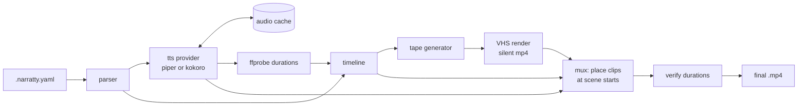

# narratty: setup & implementation plan (rev 2.4)

!!! note "Planning document"
    This is the original plan. Some of it is not built yet: chapters, the
    pronunciation lexicon, `manifest.json`, the requirements image and golden-frame
    checks. The user guide describes what exists.

> Renamed from *shellcast* on 2026-09-29: that name is taken on PyPI and npm and used
> by several terminal projects and a commercial iOS app.

`narratty` is the standalone terminal recorder for the Video-as-Code pipeline and
the symmetric peer to demo-machine. It turns a `.narratty.yaml` spec into a
narrated terminal video, doing its own TTS, timing, VHS rendering and muxing. It is
usable on its own, and the top-level `videogen` CLI also generates its spec from the
combined tutorial file.

> **What changed in rev 2** (vs. the pasted draft)
> 1. Two run modes: **native** (host-installed Python CLI + host tools) and
>    **sandboxed** (the same CLI re-executes itself inside `narratty-base` via
>    Docker/Podman). See [Run modes](#run-modes-native-and-sandboxed).
> 2. A concrete **modern Python stack** (uv, Typer, Pydantic v2, pydantic-settings,
>    Rich, ruff, mypy, nox, pytest + syrupy). See [Tech stack](#tech-stack).
> 3. **Shell completion** for bash/zsh/fish/PowerShell with dynamic completers
>    for voices, providers, scene ids and spec files. See [Shell completion](#shell-completion).
> 4. **Sync model fix**: the draft appended `Sleep <audio>` *after* the actions but
>    concatenated audio back-to-back, so narration drifts ahead of the video by the
>    typing time of every scene. Rev 2 computes an explicit timeline and places each
>    clip at its scene's start. See [Sync model](#sync-model).
> 5. New actions `wait` and `hidden` scenes, new commands (`init`, `schema`,
>    `voices`, `tape`, `cache`), and proposed answers to all open questions.
> 6. Kokoro via `kokoro-onnx` (the `kokoro` package is PyTorch-based, not ONNX) and
>    a licensing flag on Piper. See [TTS](#tts-pluggable-piper--kokoro).
> 7. **Writable workspaces** (rev 2.1): the read-only repo mount is replaced by a
>    `workspace` block with `snapshot` (default), `rw` and `ro` modes, persistent build
>    caches, artifact export and per-spec network, so demos can run builds that write
>    into the repo. See [Workspace & build outputs](#workspace--build-outputs).
> 8. **UX & flexibility** (rev 2.1): draft previews, subtitles, pronunciation lexicon,
>    deterministic prompt/env, hooks, spec reuse, plugins, and more. See
>    [UX & flexibility](#ux--flexibility-considerations).
> 9. **Sandbox permissions in the spec** (rev 2.2): network (`none`/`full`/`allowlist`
>    of host:port, for licence servers and remote caches), env passthrough and extra
>    mounts, with a consent prompt. See [Sandbox permissions](#sandbox-permissions).
> 10. **Layered pronunciation lexicon** (rev 2.2): built-in, user, project, spec.
>    See [Pronunciation lexicon](#pronunciation-lexicon).
> 11. **Tooling aligned with repo-env** (rev 2.2), plus the decisions confirmed so far.
>    See [Decisions](#decisions-confirmed).
> 12. **Incremental builds** (rev 2.4): per-scene recording cache, scene ranges and a
>    watch loop. See [Incremental builds](#incremental-builds).

---

## Goals

- One command turns a `.narratty.yaml` into a narrated `.mp4`.
- Voiceover-synchronized: every narration clip starts exactly when its scene starts
  on screen, and a scene never ends before its narration does.
- Pluggable TTS with two supported local providers: Piper and Kokoro.
- Reproducible: pinned toolchain, hash-based audio cache, deterministic tapes.
- Runs **sandboxed** (container, spec declares tools and paths) **or natively**
  (after `uv tool install narratty`), with the same CLI and the same spec.
- First-class CLI ergonomics: rich errors with YAML line numbers, shell completion,
  JSON Schema for editor autocompletion of specs.

## Non-goals

- No browser/GUI automation (that is demo-machine / Track A).
- No authoring of the combined multi-engine file (that is the `videogen` CLI).
- No cloud TTS.
- No native Windows support in v1 (Windows users run sandboxed mode or WSL).

---

## Run modes: native and sandboxed

One Python package, one CLI. The mode only decides *where* the pipeline runs.

| | **native** | **sandboxed** (`docker` / `podman`) |
|---|---|---|
| Install | `uv tool install narratty` (or `pipx install narratty`); `narratty[kokoro]` for Kokoro | Same CLI on the host, plus Docker or Podman |
| Where commands run | Your shell, your user, your filesystem | Inside `narratty-base`, non-root, no network |
| Tools (`vhs`, `ffmpeg`, `ttyd`, `requires.tools`) | Must be on `PATH`; `doctor` checks and prints install hints | Baked into the image or the generated requirements layer |
| `workspace` | Same modes; snapshot is a scratch clone on the host | Same modes; the chosen dir is bind-mounted at `/work` |
| Reproducibility | Best effort; `doctor` warns on version drift from pinned versions | Pinned by image digest |
| Use for | Fast authoring loop, trusted specs, machines without Docker | CI, reference renders, specs you did not write |

### Selecting the mode

```
narratty build demo.narratty.yaml --runtime native|docker|podman|auto
```

Precedence: CLI flag > `NARRATTY_RUNTIME` env > user config
(`~/.config/narratty/config.toml`) > default `auto`.

`auto` resolves to: **native** when already inside the container
(`NARRATTY_IN_CONTAINER=1`), otherwise **docker**, then **podman** if either is
available, otherwise **native** with a one-line warning that the run is not
sandboxed. The resolved mode is always printed on the first line of output.

### How sandboxed mode works

The host CLI acts as a thin launcher:

1. Parse and validate the spec on the host (fast failure, good errors, no container
   start for typos).
2. Resolve the image: `narratty-base:<cli-version>@<digest>`, or the hash-tagged
   requirements layer when `requires.tools` exceeds the base (built with network,
   then run without).
3. Run one container, re-invoking the same subcommand inside it with
   `--runtime native`:

```bash
docker run --rm \
  --user "$(id -u):$(id -g)" \
  --read-only --tmpfs /tmp --tmpfs /home/narratty \
  --cap-drop ALL --security-opt no-new-privileges \
  --network none \
  -e NARRATTY_IN_CONTAINER=1 \
  -v "$WORKSPACE_DIR:/work:rw" \
  -v "$PWD/out:/out:rw" \
  -v "$CACHE_DIR:/cache:rw" \
  -v narratty-cache-bazel:/home/narratty/.cache/bazel \
  -w /work \
  narratty-base:0.1.0@sha256:... \
  build /work/demo.narratty.yaml -o /out/demo.mp4 --runtime native
```

- `$WORKSPACE_DIR` is the snapshot dir (default), the repo itself (`rw`), or the repo
  with `:ro`. `--network` follows `sandbox.network` (see
  [Sandbox permissions](#sandbox-permissions)). One named volume per entry in
  `workspace.caches`.
- The audio cache is a host directory (`platformdirs` user cache dir) mounted into
  the container, so native and sandboxed runs share cache hits.
- VHS drives headless Chromium; under `--cap-drop ALL` it needs its own sandbox
  disabled (`VHS_NO_SANDBOX=true`). The container is the sandbox.
- Podman runs rootless with the same flags (`--userns keep-id` instead of `--user`).
- The CLI version and the image tag are released together, so a given `narratty`
  always runs the image it was tested with.

### Safety note for native mode

A spec's `type_command` actions are real commands executed in a real shell as your
user. Native mode is for specs you trust. `narratty build` in native mode prints the
list of commands on first run of a spec and `--yes` / `NARRATTY_ASSUME_YES` skips the
prompt (CI). Sandboxed mode needs no prompt.

---

## Workspace & build outputs

Many demos run a build (`bazel build //...`, `cmake --build`, `npm run build`) that
writes into the repo: `bazel-*` symlinks, `build/`, `node_modules/`, lockfile
updates. A read-only repo mount breaks those demos, and a plain read-write mount has
two problems: it dirties your real checkout, and the second render starts from a
different state than the first (the build is already done, output looks different).

So the workspace gets an explicit mode:

| `workspace.mode` | What `/work` is | Use for |
|---|---|---|
| **`snapshot`** (default) | A disposable copy of the repo, writable, deleted after the render | Anything that builds or edits files; every render starts from the same clean state |
| `rw` | The real repo, bind-mounted read-write | When the demo must leave results behind, or the repo is too big to copy |
| `ro` | The real repo, read-only | Pure tours (`ls`, `cat`, `git log`); fastest, safest |

**How `snapshot` works** (identical in native and sandboxed mode):
1. `git clone --local --no-checkout` into a scratch dir under the narratty cache
   (objects are hard-linked, so it is fast even for big repos), then check out `HEAD`.
2. With `include_uncommitted: true` (default), copy modified and untracked,
   non-ignored files on top (`git ls-files -m -o --exclude-standard`), so you can
   demo work in progress without committing.
3. Non-git directories fall back to a copy honouring `.gitignore`/`.narrattyignore`.
4. Mount or `cd` into it, render, copy `artifacts` to `out/`, delete the snapshot
   (`--keep-workspace` keeps it for debugging and prints its path).

**Build caches.** Demo builds should be quick on screen. `workspace.caches` maps a
name to a path inside the session (e.g. `~/.cache/bazel`, `~/.npm`, `~/.m2`). In
sandboxed mode each becomes a named Docker volume `narratty-cache-<name>`; in native
mode the real cache dirs are used. Combine with a `hidden` warm-up scene or a
`before` hook (see UX below) so the recorded build shows a fast incremental run.

**Ownership.** Containers run with the caller's UID/GID (`--user` on Docker,
`--userns keep-id` on Podman), so anything written to an `rw` workspace or `out/` is
owned by you, not root.

**Network, secrets, extra mounts.** Declared in the spec's `sandbox` block, next to
`workspace`; see [Sandbox permissions](#sandbox-permissions).

**Guard rails.** `rw` mode requires a clean git tree unless `--allow-dirty` is passed,
and prints which paths the render changed afterwards (`git status --short`), so a demo
never silently mixes with your own edits.

---

## Sandbox permissions

Some demos need to reach the outside: a licence server for a commercial tool, a
Bazel/ccache remote cache, a package registry. Like `workspace.mode`, this is declared
in the spec, because the spec author knows what the demo needs.

```yaml
sandbox:
  network: none | allowlist | full   # default: none
  allow_hosts: [host:port, ...]      # only for allowlist
  env_passthrough: [NAME, ...]       # copied from your shell; values never live in the spec
  env: { NAME: value }               # fixed, non-secret values
  extra_mounts: [{ host, container, mode }]   # e.g. ~/.netrc, a licence file
  ssh_agent: false                   # forward SSH_AUTH_SOCK (e.g. git over ssh)
  docker: false                      # mount the engine socket (Docker outside of Docker)
```

**How `allowlist` works.** The container sits on an internal Docker network with no
route out. A small forwarder sidecar (part of narratty, same image) listens on each
allowed `host:port` and passes TCP through to the real host; `--add-host` maps each
name to the sidecar. Because it forwards plain TCP, it works for raw protocols
(FlexLM-style licence servers) and for TLS (remote caches, SNI and certificates
intact), and no proxy settings are needed inside the demo. Anything not listed fails
to resolve or connect.

**Who decides.** The spec declares what it needs; you stay in control:
- **Consent**: the first run of a spec that asks for more than `network: none`, any
  `env_passthrough`, `extra_mounts`, `ssh_agent` or `docker` shows a short summary and asks
  (questionary prompt). The approval is remembered per spec path and a hash of its
  `sandbox` block, so a changed spec asks again. `--yes` for CI.
- **Overrides**: `--network none|allowlist|full` and `--allow-host` on the command
  line; a user policy in `~/.config/narratty/config.toml` can cap what any spec may
  get (e.g. `max_network = "allowlist"`, `allow_env = ["LM_LICENSE_FILE"]`). A spec
  that needs more than the cap fails with a clear message rather than running
  half-broken.
- **Native mode** cannot enforce any of this. narratty says so once and runs with your
  normal environment and network.
- `manifest.json` records the effective permissions of every render, and `doctor`
  warns that network-dependent renders are less reproducible.

Milestones: `none`, `full`, env passthrough and extra mounts in v1; `allowlist` right
after (it needs the sidecar).

---

## Tech stack

Target **Python ≥ 3.12**. Heavy dependencies are lazy-imported so `--help` and
completion stay fast.

| Concern | Choice | Why |
|---|---|---|
| Project/env/lock | **uv** (`uv.lock`, `uv tool install`) | Same as repo-env |
| Build backend / version | **hatchling** + **hatch-vcs** | Version from git tags, same as repo-env |
| Task runner | **nox** (uv backend) | Same session layout as repo-env (`lint`, `check_types`, `tests`, `integration`) |
| Prompts | **questionary** | Consent prompts; same as repo-env |
| CLI | **Typer** (Click underneath) | Type-hint CLI, Rich help, built-in shell completion |
| Terminal output | **Rich** | Progress per stage, tables for `voices`/`doctor`, pretty errors |
| Spec models | **Pydantic v2** | Validation, discriminated unions for actions, JSON Schema export |
| Config/env | **pydantic-settings** | `NARRATTY_*` env + TOML user config, same models |
| YAML | **ruamel.yaml** (safe loader) | Keeps line/column so validation errors point at the YAML line |
| Paths | **platformdirs** | Correct cache/config dirs on Linux and macOS |
| Downloads (voices/models) | **httpx** + sha256 verification | Pinned model files, resumable, no network in container |
| Audio | `ffprobe`/`ffmpeg` subprocess; **soundfile** for WAV I/O in Kokoro | No heavyweight audio stack |
| Piper | **piper-tts** (Python package, provides `piper`) | Same package in native and container; no separate binary download |
| Kokoro | **kokoro-onnx** + onnxruntime (optional extra `narratty[kokoro]`) | ONNX, no PyTorch; ~300 MB model instead of multi-GB torch |
| Lint/format | **ruff** | Single fast tool |
| Types | **mypy** (strict on `src/`) | Same as repo-env |
| Docs | **mkdocs-material** + mkdocstrings, versioned with mike | Same as repo-env |
| Commits/releases | **commitizen**, CHANGELOG, release workflow | Same as repo-env |
| Tests | **pytest**, **syrupy** (snapshot tapes), **hypothesis** (timeline math) | Golden tapes as snapshots |
| Hooks/CI | **pre-commit** (ruff, mypy, codespell), GitHub Actions with a uv cache | |
| Code quality | vulture, fawltydeps | Same as repo-env |
| Container | Multi-stage Dockerfile, `uv sync --frozen` in the image | Same lockfile as native |

`pyproject.toml` sketch:

```toml
[project]
name = "narratty"
dynamic = ["version"]
license = { text = "MIT" }
requires-python = ">=3.12"
dependencies = [
  "typer>=0.12", "rich>=13", "questionary>=2.0", "pydantic>=2.7",
  "pydantic-settings>=2.3", "ruamel.yaml>=0.18", "platformdirs>=4", "httpx>=0.27",
  "piper-tts>=1.3",
]

[project.scripts]
narratty = "narratty.cli:app"

[build-system]
requires = ["hatchling", "hatch-vcs"]
build-backend = "hatchling.build"

[project.optional-dependencies]      # grouped like repo-env
kokoro = ["kokoro-onnx>=0.4", "soundfile>=0.12"]
test = ["pytest", "pytest-cov", "pytest-xdist", "syrupy", "hypothesis"]
lint = ["ruff"]
type-check = ["mypy"]
docs = ["mkdocs-material", "mkdocstrings[python]", "mike"]
dev = ["nox", "commitizen", "narratty[test,lint,type-check,docs,kokoro]"]
```

---

## Shell completion

Typer provides completion for **bash, zsh, fish and PowerShell**:

```bash
narratty --install-completion        # detects the current shell and installs it
narratty --show-completion zsh       # print the script (for dotfiles / packaging)
```

Dynamic completers (`autocompletion=` callbacks) on top of the built-in ones:

| Argument / option | Completes |
|---|---|
| `<spec>` | `*.narratty.yaml` / `*.narratty.yml` in the current tree |
| `--provider` | `piper`, `kokoro` (Kokoro only if the extra is installed) |
| `--voice` | voice ids for the provider in the spec or `--provider` (from the curated catalog, no model loading) |
| `--scene` / `--from-scene` | scene ids read from the spec on the command line |
| `--runtime` | `auto`, `native`, `docker`, `podman` |
| `--theme` | VHS theme names (static list shipped with the package) |

Rules that keep completion usable:
- Completers never import onnxruntime, piper or kokoro and never start a container;
  they read static catalogs and the spec file only. Target < 150 ms.
- In sandboxed mode completion still runs on the host CLI, so it works identically.
- A test runs each completer through Click's completion test harness.

---

## Project layout

```
narratty/
├── pyproject.toml            # package + entry point (narratty = narratty.cli:app)
├── uv.lock
├── README.md                 # this plan, later the user guide
├── Dockerfile                # narratty-base (VHS + ttyd + ffmpeg + Piper + CLIs)
├── Dockerfile.kokoro         # FROM narratty-base, adds kokoro-onnx + model
├── src/narratty/
│   ├── __init__.py
│   ├── cli.py                # Typer app: commands + completers
│   ├── settings.py           # pydantic-settings: env, config file, defaults
│   ├── model.py              # Pydantic models for .narratty.yaml
│   ├── parser.py             # ruamel load → model; errors with line/col
│   ├── schema.py             # JSON Schema export
│   ├── timeline.py           # scene start/end times from actions + audio
│   ├── tape.py               # timeline → byte-stable VHS .tape
│   ├── render.py             # run VHS → silent video
│   ├── mux.py                # place clips on the timeline, mux onto video
│   ├── workspace.py          # snapshot/rw/ro prep, caches, artifact export, cleanup
│   ├── runtime/
│   │   ├── base.py           # Runtime protocol: run(cmd, spec, settings)
│   │   ├── native.py         # subprocess on the host
│   │   └── container.py      # docker/podman launcher, mounts, image resolve
│   ├── tts/
│   │   ├── base.py           # TtsProvider protocol + registry
│   │   ├── normalize.py      # shared text normalization
│   │   ├── catalog.py        # curated voices: id, url, sha256, license
│   │   ├── piper.py
│   │   └── kokoro.py
│   ├── cache.py              # content-addressed audio cache
│   ├── media.py              # ffprobe helpers (durations, stream checks)
│   ├── doctor.py             # preflight per runtime
│   └── data/
│       ├── voices.toml       # curated catalog
│       └── themes.txt        # VHS theme names for completion
└── tests/
    ├── unit/                 # parser, timeline, tape snapshots, cache keys
    ├── contract/             # each TtsProvider against the protocol
    ├── cli/                  # CliRunner + completion tests
    └── integration/          # end-to-end build (marked, runs in container CI)
```

---

## The `.narratty.yaml` spec

```yaml
# yaml-language-server: $schema=https://raw.githubusercontent.com/ditschi/narratty/main/schema/v1.json
version: 1
meta:
  title: "Repository layout tour"
tts:
  provider: piper                 # piper | kokoro
  voice: en_US-lessac-medium      # provider-specific voice id
  # piper:  { length_scale: 1.0 }
  # kokoro: { speed: 1.0 }
timing:
  narration_buffer_ms: 500        # silence after each narration (matches demo-machine)
  lead_in_ms: 300                 # before the first scene
  tail_ms: 1000                   # after the last scene
terminal:
  width: 1200
  height: 700
  theme: "Dracula"
  font_size: 22
  typing_speed_ms: 40             # overridable per scene
  shell: bash
requires:                         # drives the container; checked by doctor in native mode
  tools: [bat, eza, yazi, bazelisk]
workspace:                        # see "Workspace & build outputs"
  source: .                       # repo to demo, relative to the spec file
  mode: snapshot                  # snapshot (default) | rw | ro
  include_uncommitted: true       # snapshot: carry over modified + untracked files
  caches:                         # persistent across renders, never part of the repo
    bazel: ~/.cache/bazel
  artifacts:                      # copied to out/ after the render
    - bazel-bin/app/app
sandbox:                          # what the demo may reach; see "Sandbox permissions"
  network: allowlist              # none (default) | allowlist | full
  allow_hosts:
    - license.example.com:27000   # e.g. a licence server (raw TCP)
    - cache.example.com:443       # e.g. a Bazel remote cache
  env_passthrough: [LM_LICENSE_FILE, BAZEL_REMOTE_CACHE_TOKEN]   # names only
  env:
    TERM: xterm-256color
  extra_mounts:
    - { host: ~/.netrc, container: ~/.netrc, mode: ro }

scenes:
  - id: setup
    hidden: true                  # runs but is not recorded (VHS Hide/Show)
    actions:
      - run: "cd /work && clear"

  - id: intro
    narration: >
      This is a quick tour of the repository layout.
    actions:
      - run: "eza --tree --level=1 ."
      - wait: { screen: '\$ $', timeout_ms: 5000 }   # wait for the prompt to return

  - id: wrap
    narration: >
      That is the high level map.
```

Changes vs. draft: top-level `version`, a `timing` block, `hidden` scenes, `wait`
action, `shell`, and a schema comment so editors autocomplete and validate specs
(`narratty schema > narratty.schema.json`).

### Actions (v1)

Modelled as a Pydantic discriminated union; unknown keys are errors.

| Action | Meaning | VHS emission |
|---|---|---|
| `run: "…"` | type a command, press Enter, pause `timing.run_hold_ms` | `Type "…"`, `Enter`, `Sleep` |
| `type_command: "…"` | type text at the scene's typing speed | `Type "…"` |
| `enter` | press Enter (legacy; write `key: Enter`) | `Enter` |
| `ctrl_sequence: "C-c"` | control chord | `Ctrl+C` |
| `hold: auto \| <ms>` | pause; `auto` = fill to the end of the narration | `Sleep <n>ms` |
| `wait: <regex>` or `wait: { screen: <regex>, timeout_ms }` | block until the regex matches the last line | `Wait+Screen@<t> /<regex>/` |
| `key: "<VHS key>"` | VHS key, case-insensitive, optional repeat count | `<key>` |

`narration` is scene-level (one voiceover per scene).

---

## Pipeline



1. **parse**: load and validate into typed models (host side, always).
2. **tts**: one clip per narrated scene; cache hit skips synthesis. Scenes are
   synthesized in parallel (thread pool, `--jobs`).
3. **durations**: `ffprobe` each clip for exact seconds.
4. **timeline**: compute each scene's start and length (below).
5. **tape**: emit the byte-stable `.tape`.
6. **render**: `vhs scene.tape` → silent `video.mp4`.
7. **mux**: build the narration track by placing each clip at its scene start
   (`adelay` + `amix`, or a generated silence-padded concat), then mux onto the video.
8. **verify**: ffprobe the result; fail if total video length differs from the
   timeline by more than a threshold (default 250 ms), warn above 100 ms.

---

## Sync model

The draft emitted `actions` then `Sleep <audio>` per scene, but concatenated audio
back to back. Each scene's video was therefore `typing + audio` long while its audio
was only `audio` long, so narration drifted earlier with every scene.

Rev 2 makes the timeline explicit:

- Narration starts **when the scene starts**, so the voice talks while the command is
  typed (natural screencast feel). Option `narration_start: after_actions` per scene
  for the draft's behaviour.
- `action_ms` = deterministic time of the scene's actions: characters × typing
  speed, plus fixed key costs, plus literal `hold` values. `wait` counts its expected
  time as 0 and relies on the fill below.
- `scene_ms = max(action_ms, audio_ms + narration_buffer_ms)`; the tape appends
  `Sleep (scene_ms - action_ms)` after the actions. `hold: auto` is where that fill
  goes if it appears mid-scene.
- Scenes without narration use their literal timing. `hidden` scenes contribute 0 ms.
- The mux places clip *n* at `lead_in_ms + Σ scene_ms[0..n-1]`, so an error in one
  scene never accumulates into later scenes' audio.
- Known limit: a command whose output takes longer than its scene's fill (or a `wait`
  that blocks long) stretches the video. `verify` catches this; the fix in the spec is
  a larger `hold` or moving the slow command into a `hidden` scene.

---

## TTS: pluggable Piper + Kokoro

```python
# tts/base.py
class TtsProvider(Protocol):
    name: ClassVar[str]
    model_version: str

    def synthesize(self, text: str, voice: str, out: Path, opts: ProviderOpts) -> Path: ...
    def list_voices(self) -> list[VoiceInfo]: ...
    def check(self) -> list[DoctorFinding]: ...  # used by doctor
```

| Provider | How | Voice ids | Notes |
|---|---|---|---|
| Piper | `piper-tts` package (`piper` CLI / Python API), text on stdin | `en_US-lessac-medium` | CPU, tiny models, fast; default and CI provider |
| Kokoro | `kokoro-onnx` + onnxruntime → 24 kHz WAV | `af_heart`, `am_adam` | 82M model, better prosody; optional extra and separate image |

- **Selection**: `tts.provider` + `tts.voice`; validation checks the voice against the
  catalog (see answers below).
- **Cache key**: `sha256(provider, voice, normalized_text, model_version, sorted opts)`.
  Content-addressed under the user cache dir; `narratty cache prune --older-than 30d`.
- **Normalization**: shared by both providers (whitespace, numbers, punctuation) so
  keys and prosody stay consistent.
- **Parity with demo-machine**: same provider + voice + normalization gives identical
  audio on both tracks. Share `normalize.py` and `voices.toml` with demo-machine if
  possible.
- **Failure handling**: missing package, model or voice fails in `doctor`/`validate`,
  never mid-render.
- **Licensing flag**: Piper development moved to OHF-Voice/piper1-gpl and current
  `piper-tts` releases are **GPL-3.0**; both Piper and Kokoro rely on espeak-ng (GPL)
  for phonemization. Individual voices have their own licences (recorded per voice in
  `voices.toml`). Calling Piper as a subprocess instead of importing it keeps
  narratty's own licence independent (e.g. MIT or Apache-2.0); importing it as a
  library would pull narratty towards GPL-3.0.

---

## VHS tape generation

- Header from `terminal`: `Output`, `Set Width/Height/FontSize/Theme/Shell/TypingSpeed`.
- Per scene: a `# scene: <id>` comment, then `Type`/`Enter`/`Ctrl+…`/`Wait`/`Sleep`.
- `hidden` scenes are wrapped in `Hide` … `Show`.
- Durations are emitted in integer milliseconds; ordering is deterministic, so the
  tape is byte-stable for a given spec and audio set (snapshot-tested).
- `narratty tape <spec>` prints the tape without rendering, for debugging.

## Asciicast output

`build --format cast` records without VHS. `render/script.py` turns spec and timeline
into steps (`Type`, `Press`, `Sleep`, `WaitScreen`, `Hide`, …); `render/tape.py`
prints them as a tape, `render/cast.py` plays them in a pseudo-terminal and writes
asciicast v2 events. Its clock stops while hidden, so hidden output lands at the
moment recording resumes. Visible scenes become markers; their recorded starts
place the clips. `render/player.py` writes the page (asciinema-player with
`audioUrl`, cast and MP3 embedded).

---

## Packaging & container

### Images

- **`narratty-base`**: pinned `debian:stable-slim` digest, Python 3.12, the
  `narratty` package installed with `uv sync --frozen`, `vhs` + `ttyd` + `ffmpeg`
  (pinned), Chromium for VHS, fontconfig + one monospace Nerd Font, Piper with one
  default voice, and the curated CLIs (`bat`, `eza`, `yazi`, `fd`, `ripgrep`, `git`,
  `jq`). Non-root user `narratty`. `ENTRYPOINT ["narratty"]`.
- **`narratty-base:<ver>-kokoro`**: `FROM narratty-base`, adds `kokoro-onnx`,
  onnxruntime and the pinned Kokoro model. Pulled only when `tts.provider: kokoro`.
- Both published to GHCR with the CLI release.

### Long-tail tools

If `requires.tools` names something outside the base, the launcher generates a thin
`FROM narratty-base` Dockerfile that installs only those tools with a pinned
installer (`mise` by default, version-pinned apt as fallback) and tags it
`narratty-req:<sha256(requires + base digest)>`. Cached locally, rebuilt only when the
requirements or the base change. Network is enabled only for that build.

In native mode the same list is only checked (`doctor` reports what is missing and how
to install it).

### Paths, mounts, sandboxing

- The workspace (see [Workspace & build outputs](#workspace--build-outputs)) is bind
  mounted at `/work`, the output dir at `/out`; repo data is never baked into an image.
- Non-root, read-only rootfs with tmpfs for `/tmp` and `$HOME`, `--cap-drop ALL`,
  `no-new-privileges`, `--network none`.
- `videogen` calls `narratty build` and gets the same runtime selection for free.

---

## CLI surface

Global options: `--runtime`, `--image`, `--cache-dir`, `--jobs`, `-v/-q`, `--json`
(machine-readable output for `videogen`), `--yes`, `--install-completion`,
`--show-completion`, `--version`.

| Command | Does |
|---|---|
| `narratty init [path]` | Scaffold a commented `.narratty.yaml` with the schema line |
| `narratty validate <spec>` | Parse + schema-validate; check voice, actions, `requires` |
| `narratty schema` | Print the JSON Schema for the spec |
| `narratty voices [--provider]` | List catalog voices, marking which are installed locally |
| `narratty voices pull <id>` | Download and verify a voice/model (native mode) |
| `narratty plan <spec>` | Print the timeline and total length without rendering (estimates if audio is not cached) |
| `narratty tts <spec>` | Synthesize or cache-hit all clips; print durations and the timeline |
| `narratty tape <spec>` | Print the generated `.tape` |
| `narratty render <spec>` | TTS + tape + VHS → silent video |
| `narratty build <spec> -o out.mp4` | Full pipeline + verify, incremental; `--scenes`, `--clean`, `--watch`, `--draft`, `--fast`, `--workspace-mode`, `--keep-workspace`, `--network`, `--var k=v` |
| `narratty doctor [<spec>]` | Preflight for the chosen runtime: tools and versions, voices, mounts, container runtime, image availability |
| `narratty cache {info,prune}` | Inspect or prune the audio cache, scene recordings, snapshots and build-cache volumes |

Exit codes: 0 ok, 1 unexpected error, 2 usage error, 3 validation error, 4 missing
dependency (doctor), 5 render/mux failure, 6 sync verification failure, 7 a recorded
command exited contrary to its `expect_exit`.

---

## Determinism & caching

- Content-addressed audio cache (key above), shared between native and sandboxed runs.
- Content-addressed scene recordings, chained by key; see [Incremental builds](#incremental-builds).
- Byte-stable `.tape` for a given spec + audio set.
- Pinned: base image digest, Python lockfile, Piper and Kokoro model files (sha256 in
  `voices.toml`), VHS, ttyd, ffmpeg, font.
- `build --check`: rebuild and compare sampled frames (one per scene, at scene
  midpoint) against a golden set, like demo-machine's golden frames. Only meaningful in
  sandboxed mode.

---

## Incremental builds

!!! note "Status"
    Implemented (B + C below, `--watch`, scene ranges for `--format cast`). Where the
    code differs from the first proposal, a note says so.

### How authors work

Getting a video ready is a loop with a few kinds of edits, roughly in order of
frequency:

| Edit | Example | Re-recorded today | Needs re-recording |
|---|---|---|---|
| Narration text, voice, lexicon | reword a sentence, fix a pronunciation | whole tape | no: only the scene's length changes |
| Overlays, browser views, subtitles, end card | move a note, change a style | whole tape | no: composited after recording |
| Timing (`hold`, typing speed, `fast`) | slow down one command | whole tape | that scene, or none if only pauses change |
| Commands of one scene | change a flag, add a `wait` | whole tape | that scene, and later scenes if they depend on its effects |
| Hidden setup, `terminal`, `workspace`, `sandbox` | new theme, different font size | whole tape | everything |

The slow stage is VHS: it records in real time, so a six-minute video takes at least
six minutes to record, even when only a word of narration changed. TTS is already
cached per clip. The goal is to make the first two rows free, the middle rows cost
only the scenes involved, and to let authors look at just the part they work on.

### What carries between scenes

All scenes run in one shell. Scene *n* can depend on earlier scenes in two ways:

1. **State**: cwd, env vars, shell functions, files, running processes (`tmux`).
2. **Screen**: whatever earlier output is still visible when scene *n* starts.

Any scheme that records a scene without first running the earlier ones gets both
wrong. Snapshotting the shell (CRIU, `docker commit`) does not cover processes,
ttyd and the terminal emulator, so it is out. The earlier scenes have to run again;
the question is only how fast, and which recordings can be reused.

### Options

Common building block for B to D: **fast replay**. Scenes before the first one that
needs recording run inside `Hide`, typed with `Type@0ms`, without narration sleeps
and holds, but keeping `wait` and a wait for the prompt after each command. A
replayed scene costs the run time of its commands, not its video time.

- **A. Status quo**: record the whole tape on every build.
- **B. Scene range** (`--scenes`): fast-replay the scenes before the range, record
  the range, stop. The output shows the range only. No cache.
- **C. Chained segment cache**: cut the recording at scene markers into per-scene
  segments and cache them. A segment's key contains the key of the scene before it,
  so a change in scene *k* re-records *k* to the end and reuses 1 to *k*-1. Narration
  and everything composited later are not part of the key.
- **D. Independent segment cache**: like C, but a segment's key contains only its
  own scene. A change in scene *k* re-records *k* alone and reuses all others.

Example: 12 visible scenes of 30 s each (6 min of video), replay cost 2 s per scene.

| Edit | A | B (range = edited scene) | C | D |
|---|---|---|---|---|
| Narration of any scene | 6 min | 32 s to 52 s, range only | ~0 s (stitch + mux) | ~0 s |
| Commands of scene 2 | 6 min | 32 s, range only | 5.5 min | 32 s |
| Commands of scene 8 | 6 min | 44 s, range only | 2.7 min | 44 s |
| Commands of scene 12 | 6 min | 52 s, range only | 52 s | 52 s |
| Result matches a clean build | yes | yes, for the range | yes | **no**, see below |
| Relative complexity | none | small | medium | medium, plus failure modes |

A wrong result from D is likely, not exotic:

- scene *k* creates, edits or deletes a file that *k*+1 lists, prints or builds;
- scene *k* changes cwd, an env var or a shell function used later;
- scene *k*'s last screen differs, so the cached first frame of *k*+1 jumps (every
  scene that does not start with `clear` shows the previous output).

None of these can be detected from the spec, and a stale video looks plausible, so
the error tends to surface only when someone watches the final video. Asking authors
to mark scenes as independent moves that risk onto them.

### Recommendation

**B + C**, not D. *(confirmed, implemented)*

- C makes the most frequent edits (narration, overlays, subtitles, timing that only
  moves pauses) cost no recording at all, and is always exact.
- B covers what D would win for command edits: while working on scene 8, record
  scene 8 (after fast replay), watch that, and leave the full build for later. A
  range recording also fills C's cache, because the keys come from the spec, so the
  next full build only records what the range did not cover.
- D's extra speed only matters for full builds after command edits early in the
  video, and it pays for that with silently wrong videos.

### C in detail

**Recording key** of scene *n*:

```text
key(n) = sha256(key(n-1), scene n's recorded content, render settings)
key(0) = sha256(narratty version, VHS/ttyd versions, image digest or "native",
                terminal block, workspace mode, sandbox block, env, cache.inputs files)
```

- *Recorded content*: actions as typed and pressed, `wait` patterns, `hidden`,
  `fast`, `timelapse`, typing speed and literal `hold` values.
- *Not in the key*: narration, voice, TTS options, lexicon, `narration_buffer_ms`,
  the `hold: auto` fill, overlays, browser views, subtitles, end card, scene titles.
  These only change pause lengths or are composited after recording.
- *Render settings*: frame rate and size, so draft and full segments never mix.
- Hidden scenes take part in the chain like any other scene; their segment is empty.

**Narration-only changes.** Segments are stored the way `--fast` records them: pauses
shortened, their positions noted. At stitch time each pause is expanded to the
length the current timeline asks for by repeating its last frame (the existing
`plan_stills`/`repeat_frames` path).

*As built:* this only holds when pauses are shortened, i.e. with `--fast` or
`--draft`, or in scenes with `fast: true`. A build without them records pauses in
full, so a pause's length is part of its scene's key and a narration change that
alters it records that scene and the ones after it. Making every incremental build
shorten pauses would turn the "screen was not still" failure on for everyone, so
the default stays exact and the fast loop is opt-in. A pause up to 1 s is not
shortened either, so a narration edit that moves a pause across that limit changes
the key once.

**Cutting and stitching.**

- The tape always records with scene markers (the screenshots the timelapse path
  already takes), so scene starts in the recording are known to the frame.
- The tape is split into sections: lead-in, each visible scene, tail and end card
  (hidden scenes and setup produce no frames and are only part of the key chain).
  Each recorded section is cut from the recording with a key frame at its start and
  stored with metadata: duration, where its shortened pauses end, and the positions
  of its markers (cues for overlays and browser views, timelapse ends).
- The silent video is the concat (stream copy) of all sections in order, then pauses
  are filled and timelapse scenes sped up as before. Clips are placed at the
  measured section starts instead of the global scale factor in `place_clips`,
  which also removes the scaling error. The frame rate used for the fills is the one
  ffprobe reports (VHS writes 25 fps whatever `Set Framerate` says).
- Exit codes are checked from the exit log of the recording that ran. Scenes taken
  from the cache are not checked again; they were when they were recorded.
- Sections are stored only after the build succeeded, so a failed build leaves
  nothing half-trusted behind.
- Overlays, browser views, subtitles and the narration track are built from the
  stitched layout as now.

**Storage.** `~/.cache/narratty/segments/<key[:2]>/<key>.mp4` plus `<key>.json`,
pruned by `narratty cache prune` like audio clips; `cache info` reports both.

**Workspace content.** Command output depends on the repository, but hashing the
workspace would invalidate everything on every edit, including edits to the spec
itself when it lives in the repo. The key therefore ignores the workspace, except for
files matched by an optional `cache.inputs` list of globs in the spec. *(confirmed)*
When the repo changed in a way that matters, `--clean` re-records.

**Asciicast.** Same keys; a segment is a slice of events with relative times, and
stitching concatenates them with offsets. Second step, after mp4.

### CLI

- `narratty build` is incremental by default. *(confirmed)*
- `--clean`: ignore cached segments and record the whole tape in one run (the cache
  is still written). For release videos, after repo changes outside `cache.inputs`,
  or when a video looks wrong.
- `--scenes RANGES` (`-s`): build only these scenes. `RANGES` is a comma-separated list of
  `id`, `from:to` (inclusive), `from:` (to the end) or `:to`; the option can be
  repeated. Scenes before and between the ranges are fast-replayed hidden. The output
  is `<name>.scenes.mp4` (`.scenes.draft.mp4` with `--draft`), with lead-in and tail,
  without the end card unless the last range reaches the end. *(confirmed: the output
  contains only the selected scenes)*
- Completion for `--scenes` lists the spec's scene ids, also after `,` and `:`. The
  completer reads ids with a line scan of the spec (no Pydantic, no ruamel model) to
  stay inside the completion budget.
- `--watch` (`-w`): build, then rebuild whenever the spec, its lexicon files, files
  under `cache.inputs` or local pages shown in a browser view change. Polls
  modification times (no new dependency) and debounces 300 ms. *As built:* a change
  during a build does not cancel it; the next build starts when it ends. Cancelling
  would need the whole pipeline (VHS, ffmpeg, containers) to be interruptible, and
  sections finished before the cancel are only stored after success anyway. Works with
  `--scenes` and `--draft`. A failed build is reported and waited out.
- `narratty plan` gets a `recording` column: `cached` or `record`, so the cost of the
  next build is visible before it starts (`--fast` plans for a fast build).
- `cache info` and `cache prune` cover the section recordings too.
- *Not built:* `build --json` / `manifest.json` output about cached scenes; neither
  exists yet. The build logs `recording 3 of 7 scenes with VHS (4 from the cache)`.

### Typical session

```bash
narratty build demo.narratty.yaml --draft --watch --scenes clone:cloned
# edit the commands of clone and cloned; each save re-records only those scenes
narratty build demo.narratty.yaml --watch
# reword narration, move overlays; each save re-stitches without recording
narratty build demo.narratty.yaml --clean
# final, exact video
```

### Risks

- **Fast replay differs from real time.** A TUI may need time between keys, or a
  command may behave differently when typed instantly. Replay keeps `wait`s, types at
  5 ms per key and cuts pauses over 1 s to 1 s. Two safety nets: a scene with
  `replay: realtime` runs at its own pace, and when a command a replayed scene started
  is still running at the end of a cut pause (the same `/proc` check `--fast` uses),
  the build remembers that scene (by the hash of its tape lines, in the cache), builds
  again with that scene at its own pace, and does so from then on. That costs one
  extra recording the first time.
- **Slow commands make replay slow.** A `bazel build` in scene 3 runs again for every
  range after it; `workspace.caches` keeps the repeat fast.
- **Time-dependent output** (dates, durations) differs between segments recorded at
  different times. Same as across clean builds; the deterministic session helps.
- **Stale cache after repo changes** outside `cache.inputs`. Mitigated by `--clean`
  and by `plan` showing which scenes come from the cache.

### Implementation order

1. `--scenes` with fast replay and id completion (B).
2. Segment cutting at markers, measured clip placement, segment cache and `--clean`,
   with narration kept out of the key through pause expansion (C).
3. `plan` cache column, `cache info`/`prune` for segments.
4. `--watch`.
5. `--format cast`: `--scenes` only. A section cache would need cast events cut and
   offset like video, and `--fast` already skips the waiting in a cast, so it stays
   without one for now.

Spec additions (`cache.inputs`, `replay`) are additive and keep `version: 1`.

The drift check also got an absolute floor: a build fails only when the video is more
than `--max-drift` off *and* more than 250 ms, because VHS ends a recording a few
frames early or late and that is a large share of a one-scene range.

---

## Testing

- **Unit**: parser errors with line numbers; action union; timeline math (hypothesis:
  clip *n* always starts at the sum of previous scene lengths, no scene shorter than
  its narration); tape snapshots (syrupy); cache key stability; settings precedence;
  runtime `auto` resolution; container command construction (snapshot of the
  `docker run` argv).
- **CLI**: `CliRunner` for every command; completion callbacks return expected values
  and do not import heavy modules.
- **Provider contract**: Piper and Kokoro satisfy `TtsProvider` and produce a readable,
  non-empty WAV for a fixture line (Kokoro tests skipped when the extra is missing).
- **Integration**: 3-scene fixture (one hidden) → `build` in the container → assert
  video + audio streams and duration ≈ timeline total; run once natively on a
  Linux CI runner with tools installed to keep native mode honest.
- CI runs without network; models are baked into the images, and native CI caches them.

---

## UX & flexibility considerations

Grouped by where they help. Items marked **v1** are worth building in the first
release; the rest are cheap to add later if the design leaves room now.

### Fast authoring loop
- **v1 `--draft`**: half resolution, low fps, audio from a length estimate
  (words ÷ speaking rate) instead of TTS. Lets you iterate on actions in seconds.
- **v1 `--scene intro --scene wrap`** and `--from-scene`: render a subset. The shell
  state still needs earlier scenes, so skipped scenes run `hidden`, not dropped.
  Superseded by `--scenes` in [Incremental builds](#incremental-builds).
- **v1 `narratty plan <spec>`**: prints the timeline table (scene, narration length,
  action length, total) and the total video length before anything renders.
- `narratty preview`: play the result (or open the draft) when done.

### Output quality and accessibility
- **v1 subtitles**: the timeline already knows each narration's start and length, so
  emit `.srt`/`.vtt` for free; `--burn-subtitles` to hard-code them.
- **v1 chapters**: scene ids/titles as MP4 chapter markers.
- **v1 pronunciation lexicon**: layered built-in, user, project and spec lists; see
  [Pronunciation lexicon](#pronunciation-lexicon). Technical words are where TTS
  sounds worst.
- More formats: `-o demo.webm`, `-o demo.gif` (GIF without audio, for READMEs).
- Per-scene voice/speed overrides, for a two-speaker dialogue or emphasis.
- Background music track with automatic ducking under narration.

### Pronunciation lexicon

Implemented without `ipa` and `--no-user-config`; the user guide's Pronunciation section
describes the shipped behaviour.

A mix of all levels, merged in this order (later wins):

| Level | Where | Holds |
|---|---|---|
| 1. Built-in | shipped with narratty, versioned | Common tech terms: `kubectl`, `nginx`, `sudo`, `YAML`, `CLI`, `GUI`… |
| 2. User | `~/.config/narratty/lexicon.toml` | Your personal preferences |
| 3. Project | `narratty.lexicon.toml` next to the spec or up to the repo root, or pulled in via `extends` | Terms of the subject being demoed, shared by a series of videos |
| 4. Spec | `tts.lexicon:` in `.narratty.yaml` | One-offs for this video |

```toml
# narratty.lexicon.toml
Bazel   = "Bay-zel"
kubectl = "cube control"
[nginx]
say = "engine x"                  # respelling, works with every provider
ipa = "ˈɛndʒɪn ˈɛks"              # used where the provider accepts phonemes
```

- Matching is whole-word; case-sensitive for entries with capitals, so `Bazel` and
  a variable called `bazel` can differ.
- **Reproducibility**: only the entries that actually change a narration go into that
  clip's cache key and into `manifest.json`, so a user entry can't silently change
  someone else's render; `--no-user-config` ignores level 2 (default in CI).
- **Sandboxed mode**: the host CLI resolves all levels and hands the container a fully
  merged spec, so user and project files never need mounting.
- `narratty lexicon show <spec>` prints the merged list with each entry's source;
  `narratty lexicon check <spec>` lists likely problem words in the narration
  (all-caps, camelCase, words with digits or dots) that no level covers.

### Predictable terminal content
- **v1 deterministic session**: clean `HOME`, fixed `PS1` (configurable, e.g.
  `prompt: "$ "` or a starship config), fixed `TZ`/`LANG`, fixed hostname/user in the
  container, `sandbox.env` for everything else. Stops real usernames, paths and
  timestamps from leaking into videos and golden frames.
- **v1 fail on command errors**: the prompt embeds an invisible exit-code marker;
  a `wait` or scene end that sees a non-zero exit fails the render with the scene id
  (opt out per action with `allow_fail: true`). Otherwise a broken demo is only
  noticed when someone watches the video.
- Redaction: `redact: ["ghp_[A-Za-z0-9]+", "$HOME"]` masks patterns in typed text.

### Flexible specs
- **v1 hooks**: `before`/`after` shell commands that run in the same workspace but are
  not recorded and do not open a VHS session (warm caches, seed files, fetch deps).
  `hidden` scenes stay for things that must happen in the recorded shell (`cd`, `export`).
- **v1 variables**: `${VAR}` and `${VAR:-default}` interpolation from `vars:` and the
  environment, so one spec serves several branches/targets (`--var target=//app:all`).
- `extends: ../common.narratty.yaml` to share terminal, TTS and lexicon settings
  across a series of videos; project-level `narratty.toml` for defaults.
- Scene snippets/includes for recurring sequences (e.g. "build and run").
- `narratty import demo.tape`: turn an existing VHS tape into a spec skeleton.

### Extensibility
- TTS providers and actions registered through Python entry points
  (`narratty.tts`, `narratty.actions`), so a team can add a provider without forking.
  Piper and Kokoro themselves are registered that way.
- Stable `--json` output and a `manifest.json` next to every render (spec hash, tool
  and model versions, image digest, per-scene timing, artifact list), which `videogen`
  and CI can consume.

### Output layout
```
out/<spec-name>/
├── <spec-name>.mp4
├── <spec-name>.srt / .vtt
├── manifest.json
├── artifacts/            # workspace.artifacts
└── debug/                # --keep-intermediates: tape, silent video, audio clips
```

### Behaviour people notice
- Ctrl+C stops the container, removes the snapshot and leaves no half-written `.mp4`
  (write to a temp name, rename on success).
- Every error names the scene id and the YAML line; unknown keys get "did you mean".
- A progress line per stage with timings; `-q` for CI, `-v` shows the exact
  `docker run` / `vhs` / `ffmpeg` commands so users can reproduce by hand.

---

## Milestones

0. **Scaffold**: uv project with repo-env's layout (hatch-vcs, nox, ruff, mypy, pytest,
   pre-commit, mkdocs, commitizen, CI and release workflows, MIT licence), Typer app with
   `--version` and working shell completion.
1. **Spec + validate**: Pydantic models, ruamel parser with line numbers, `validate`,
   `schema`, `init`, `doctor` (native tool checks).
2. **TTS layer**: `TtsProvider`, Piper backend, normalization, cache, durations,
   `voices`, `tts`.
3. **Timeline + tape + render**: timeline math, `tape`, VHS render to silent video
   (native).
4. **Mux + verify**: timeline-placed audio, mux, verify → first narrated `.mp4`
   natively.
5. **Workspace + sandboxed mode**: `snapshot`/`rw`/`ro` workspaces, caches, artifacts;
   `narratty-base` image, container runtime, hardening flags, shared cache;
   `--runtime auto`.
5a. **Sandbox permissions**: `sandbox` block, consent prompt, user policy caps;
   `none`/`full`, env passthrough, extra mounts. Then `allowlist` with the sidecar.
5b. **UX v1**: `plan`, `--draft`, subtitles, chapters, layered lexicon, deterministic
   session, exit-code checks, hooks, variables, `manifest.json`.
6. **Kokoro**: backend, `[kokoro]` extra, `-kokoro` image, voice validation for both.
7. **Requirements layer**: hash-tagged thin image from `requires.tools`.
8. **Reference render**: the Bazel-basics storyboard end to end in both modes, plus
   `--check` golden frames.

Native mode lands first (milestones 1–4) because it gives the fastest feedback loop;
sandboxed mode then wraps a pipeline that already works.

---

## Open questions: proposed answers

1. **Kokoro size in the base image** → Make it optional. Separate
   `narratty-base:<ver>-kokoro` image (pulled only when `tts.provider: kokoro`) and a
   `narratty[kokoro]` extra for native mode. Keeps the default image and CI lean and
   still gives one-command Kokoro renders.
   *Revised in 0.2:* Kokoro is the default provider and a regular dependency, and the
   one image contains it. The fp16 model (177 MB) keeps the size down; Piper stays
   for languages Kokoro lacks, such as German.
2. **Voice catalog: allowlist vs. discovery** → Both, layered. Ship a curated
   `voices.toml` (id, provider, language, download URL, sha256, licence) that drives
   validation, `voices` and completion, and accept any locally discovered model too
   (with a warning that it is uncatalogued and not pinned). Sandboxed mode accepts only
   voices baked into the image.
3. **Buffer / lead-in defaults** → Match demo-machine: `narration_buffer_ms: 500`.
   Add `lead_in_ms: 300` and `tail_ms: 1000`, all overridable in `timing` and per
   scene. Ideally both tools read the defaults from one shared place.

## Decisions (confirmed)

Confirmed by the user on 2026-09-29:
- **Default runtime**: `auto`, meaning Docker (or Podman) automatically when installed,
  otherwise native with a warning.
- **Repo home**: a public GitHub repo under `ditschi`; images on GHCR, package on PyPI.
- **macOS**: optional. Native mode on macOS is best-effort, with a non-blocking macOS
  smoke job in CI; sandboxed mode works there through Docker Desktop or Podman anyway.
- **Workspace and sandbox permissions are configured in the spec**, with CLI and user
  policy overrides.
- **Licence**: MIT (same as repo-env). Piper stays a subprocess so its GPL-3.0 does
  not apply to narratty.
- **Default workspace mode**: `snapshot`.

## Still open

Nothing blocking; the plan is ready to implement.
