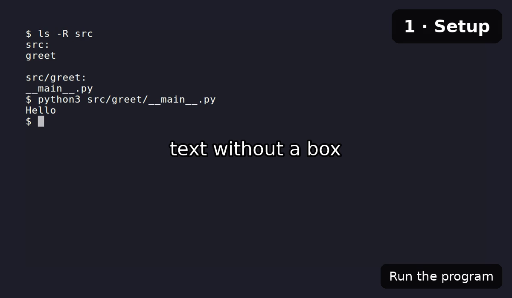

# Spec reference

A narratty video is described by a `.narratty.yaml` file. `narratty init` writes a
commented starter, `narratty validate` checks one, and `narratty schema` prints the JSON
Schema.

## Editor support

The first line `narratty init` writes tells your editor where the schema is:

```yaml
# yaml-language-server: $schema=https://raw.githubusercontent.com/ditschi/narratty/v0.2.0/schema/v1.json
```

Editors that use [yaml-language-server](https://github.com/redhat-developer/yaml-language-server)
read that comment and then offer completion, hover docs and inline errors for the
spec: VS Code with the Red Hat YAML extension, Neovim or Helix with `yaml-language-server`,
and JetBrains IDEs. The schema is committed to the repository as `schema/v1.json`,
so each release tag serves the schema of that release. `init` points the line at the
tag of the narratty version you have installed; development builds point at `main`.

Offline, or to pin a local copy, write the schema to a file and reference it relatively:

```bash
narratty schema > .narratty.schema.json
```

```yaml
# yaml-language-server: $schema=./.narratty.schema.json
```

Unknown keys are errors, and `validate` reports every problem with its line and column,
plus a "did you mean" for typos:

```text
$ narratty validate demo.narratty.yaml
demo.narratty.yaml:4:9: scenes[0].actions[0]: unknown action 'type_comand' (did you mean 'type_command'?)
```

Valid lines that can be left out or written shorter are reported as hints; they do not
fail validation:

```text
$ narratty validate demo.narratty.yaml
hint: demo.narratty.yaml:3:3: tts.voice: same as the default; leave it out
hint: demo.narratty.yaml:12:9: scenes[0].actions[2]: 'hold: auto' has no effect at the end of a scene; leave it out
ok demo.narratty.yaml: 2 scenes, 2 narrated, voice kokoro/af_heart
```

## Durations

Every `*_ms` key and `hold` take milliseconds (`1500`) or a duration with a unit:
`800ms`, `1.5s`, `2m`.

## Top level

| Key | Default | Meaning |
|---|---|---|
| `version` | `1` | Spec format version |
| `meta.title` | `Untitled` | Title of the video |
| `tts` | | Voice settings, see below |
| `timing` | | Sync settings, see below |
| `terminal` | | Look of the recorded terminal |
| `requires.tools` | `[]` | Extra commands the demo needs (checked by `doctor`) |
| `requires.narratty` | unset | narratty versions the spec needs, e.g. `">=0.3"`; see [Spec versions](#spec-versions) (since 0.5) |
| `workspace` | | What directory the demo runs in |
| `sandbox` | | Permissions of the container |
| `environment` | | Run the demo shell in a project image, Compose service or container (since 0.3) |
| `end_card` | on | Closing card, see below |
| `cache.inputs` | `[]` | Files whose content changes the recording; see [`cache`](#cache) (since 0.5) |
| `subtitles` | `none` | `none`, `files`, `track` or `burn`; see [Subtitles](building.md#subtitles) (since 0.3) |
| `overlay_styles` | `{}` | Named overlay styles; see [Overlays](#overlays) (since 0.3) |
| `scenes` | required | At least one scene |

## `tts`

| Key | Default | Meaning |
|---|---|---|
| `provider` | `kokoro` | `kokoro` or `piper` |
| `voice` | `af_heart` (`en_US-lessac-medium` with `piper`) | Voice id; see [Voices](voices.md) |
| `piper.length_scale` | `1.0` | Larger is slower speech |
| `piper.sentence_silence` | `0.2` | Seconds of silence between sentences |
| `kokoro.speed` | `1.0` | Speech speed |
| `kokoro.lang` | voice's language | Language code, e.g. `en-gb` |
| `lexicon` | `{}` | How to say terms, e.g. `{k8s: kubernetes}`; see [Pronunciation](voices.md#pronunciation) (since 0.3) |

## `timing`

| Key | Default | Meaning |
|---|---|---|
| `narration_buffer_ms` | `500` | Pause after each narration before the next scene |
| `lead_in_ms` | `300` | Silence before the first scene |
| `tail_ms` | `1000` | Time the last frame stays on screen |
| `run_hold_ms` | `500` | Pause after each `run` action (since 0.3) |
| `pause_ms` | `100` | Pause after each `key` and `ctrl_sequence` (since 0.3) |

## `terminal`

| Key | Default | Meaning |
|---|---|---|
| `width`, `height` | `1200`, `700` | Video size in pixels |
| `theme` | `Dracula` | Any VHS theme |
| `font_size` | `22` | Font size |
| `typing_speed_ms` | `40` | Time per typed key |
| `shell` | `bash` | `bash`, `zsh`, `fish` or `sh` |
| `prompt` | `"$ "` | Prompt shown in the recording |
| `layout` | `plain` | `plain` or `editor`: an explorer with preview above the shell, see [Editor layout](toolkit.md#editor-layout). The layout the recording starts in; scenes can change it, see [Layout per scene](toolkit.md#layout-per-scene) (since 0.3) |

## `workspace`

| Key | Default | Meaning |
|---|---|---|
| `source` | `.` | Directory the demo runs in, relative to the spec |
| `mode` | `snapshot` | `snapshot` (throwaway copy), `rw` (the real directory) or `ro` (read-only) |
| `include_uncommitted` | `true` | Copy uncommitted files into the snapshot |
| `caches` | `{}` | Caches kept across runs, `name: /path/in/container` |
| `artifacts` | `[]` | Paths copied out of the workspace after the run |

## `sandbox`

Only used when the demo runs in a container. Anything beyond the defaults is shown to
you for approval before the first run.

| Key | Default | Meaning |
|---|---|---|
| `network` | `none` | `none`, `allowlist` or `full` |
| `allow_hosts` | `[]` | `host:port` entries, required with `allowlist` |
| `env_passthrough` | `[]` | Host environment variables passed in |
| `env` | `{}` | Fixed environment variables |
| `extra_mounts` | `[]` | `{host, container, mode: ro\|rw}` |
| `ssh_agent` | `false` | Forward the host SSH agent |
| `docker` | `false` | Give the demo your Docker or Podman engine; [full host access](container.md#docker-in-the-demo) (since 0.3) |

## `environment`

Since narratty 0.3.

Runs the demo shell in your project's image, Compose service or container; see
[Project environments](environments.md).

| Key | Default | Meaning |
|---|---|---|
| `image` | | Image to run the shell in |
| `compose` | | `{file, service}`: run in a Compose service (`file`: one file or a list, default `compose.yaml`) |
| `container` | | Run in this running container (needs `workspace.mode: rw`) |
| `workdir` | `/work` | Where the workspace is mounted and the shell starts; for `compose` and `container` the container's working directory |
| `user` | `host` | `host` (your user id), `image` (the image's user), a user name or `UID[:GID]` |
| `env` | `{}` | Variables set in the environment's container |
| `read_only` | `false` | Mount the image's root filesystem read-only |
| `packages` | `[]` | Packages added with the image's package manager |
| `package_manager` | `auto` | `auto`, `apt`, `apk`, `dnf`, `microdnf`, `yum` or `zypper` |
| `setup` | `[]` | Commands run as root when the image is built |
| `toolkit` | `prefer` | Mount the demo toolkit first (`prefer`) or last (`fallback`) on `PATH`, or not (`off`) |

Set exactly one of `image`, `compose` and `container`.

## `end_card`

The video ends with a short card that shows the narratty logo above "Created with
narratty", a link to this documentation and a QR code of the link. The QR code sits
beside the logo and text, or above the text on a narrow terminal. When space runs out,
the logo goes first, then the QR code. The QR code is drawn in black and white so it
scans on any theme.

| Key | Default | Meaning |
|---|---|---|
| `enabled` | unset | `true` or `false`; unset follows your config (on by default) |
| `duration_ms` | `4000` | How long the card stays on screen (at least 1000) |
| `qr` | `true` | Show the QR code |

`end_card: false` is short for `end_card: {enabled: false}`. To turn the card off for
every video, put this in `~/.config/narratty/config.toml`:

```toml
[end_card]
enabled = false
```

`--end-card` / `--no-end-card` on the command line win over the spec, and the spec
wins over the config.

## `cache`

Scene recordings are cached (see [faster rebuilds](building.md#faster-rebuilds)). The
cache key covers the spec but not the files of your workspace, because hashing the
whole repository would make every edit, even to the spec itself, record everything
again.

| Key | Default | Meaning |
|---|---|---|
| `inputs` | `[]` | Globs, relative to `workspace.source`, of files the commands print or build from; when one changes, every scene is recorded again (since 0.5) |

```yaml
cache:
  inputs: ["src/**/*.py", "pyproject.toml"]
```

For other changes outside the spec, build with `--clean`.

## Scenes

| Key | Default | Meaning |
|---|---|---|
| `id` | required | Lowercase letters, digits, `-` and `_`; unique |
| `narration` | none | Text spoken while the scene plays |
| `actions` | `[]` | What happens in the terminal |
| `hidden` | `false` | Run without recording (setup); cannot have narration |
| `layout` | previous scene's | `plain` or `editor` from the start of this scene on, for it and all later scenes until one sets another; see [Layout per scene](toolkit.md#layout-per-scene) (since 0.5) |
| `typing_speed_ms` | terminal's | Per-scene typing speed |
| `pause_ms` | `timing.pause_ms` | Per-scene pause after each `key` and `ctrl_sequence` (since 0.3) |
| `narration_start` | `with_actions` | Or `after_actions` |
| `timelapse` | none | Show the scene this many times faster (greater than 1) (since 0.3) |
| `expect_exit` | `success` | Exit codes of the scene's commands: `success`, `failure` or `any`; see [Exit codes](#exit-codes) (since 0.3) |
| `fast` | `--fast` | `true`/`false`: fill long pauses with still frames or not; see [Fast pauses](building.md#fast-pauses) (since 0.3) |
| `replay` | `fast` | How the scene runs, unrecorded, before a later scene is recorded with `--scenes`: `fast` or `realtime` (at its own pace); see [scene ranges](building.md#scene-ranges) (since 0.5) |

A scene lasts as long as its actions or its narration plus `narration_buffer_ms`,
whichever is longer.

### Timelapse

A long step (a download, a build) can be shown sped up instead of hidden:

```yaml
- id: install
  narration: Installing the dependencies takes a while; here it is eight times faster.
  actions:
    - run: npm ci
- id: install-runs
  timelapse: 8
  actions:
    - wait: {screen: "added \\d+ packages", timeout_ms: 600000}
```

- The whole scene is sped up, typing included, so type the command in the scene
  before and only wait in the timelapse scene.
- Narration plays at normal speed. If it is longer than the sped-up footage, the
  last frame stays until it ends. With `narration_start: after_actions` it starts
  when the footage ends.
- A timelapse scene cannot be hidden or use `hold: auto`.
- `narratty plan` cannot know how long the waits take, so its length for the
  scene counts only the fixed actions.
- The video is re-encoded once (H.264) to speed up the scenes. `narratty tape` shows
  where the scenes are, but plain `vhs` does not speed them up.

### Actions

| Action | Example | Does |
|---|---|---|
| `run` | `- run: ls -la` | Types the command, presses Enter, pauses `timing.run_hold_ms`; may set its own `expect_exit` (since 0.3) |
| `type_command` | `- type_command: "ls -la"` | Types the text, without Enter |
| `ctrl_sequence` | `- ctrl_sequence: C-c` | Presses Ctrl plus a key |
| `key` | `- key: Enter` or `- key: Down 3` | Presses a key, optionally repeated |
| `hold` | `- hold: 1.5s` or `- hold: auto` | Waits; `auto` waits until the narration is done |
| `wait` | `- wait: "Done"` or `- wait: {screen: "Done", timeout_ms: 1m}` | Waits until the screen matches a regex (default timeout 15 s) |
| `wait` | `- wait: {prompt: true, timeout_ms: 10m}` | Waits until the command has finished and the prompt is back (since 0.3) |
| `diff` | `- diff` or `- diff: [src, README.md]` | Shows what changed since the recording started, optionally only for some paths (since 0.3) |
| `focus` | `- focus: explorer` | Moves the keyboard to `explorer` or `terminal` (editor layout) (since 0.3) |
| `reveal` | `- reveal: src/app.py` | Selects a path, relative to the workspace, in the explorer (editor layout) (since 0.3) |
| `layout` | `- layout: plain` | Switches to `plain` or `editor` at this point of the scene, for the rest of the recording until another switch; prefer the scene's `layout` key when the switch is at its start (since 0.5) |
| `overlay` | `- overlay: "Open src/main.py"` | Shows text over the video; see [Overlays](#overlays) (since 0.3) |
| `browser` | `- browser: docs/site/index.html` | Shows a web page over the terminal; see [Browser views](#browser-views) (since 0.3) |

Keys: `Enter`, `Tab`, `Space`, `Backspace`, `Delete`, `Escape`, `Up`, `Down`, `Left`,
`Right`, `Home`, `End`, `PageUp`, `PageDown`, `Insert`. Names are case-insensitive.
Older specs write Enter as `- enter`; it still works, `key: Enter` is the current form.

Every list item starts with `- `. A scene always waits for its narration after its
last action, so `hold: auto` is only needed in the middle of a scene; a scene has at
most one. See [Writing specs](writing-specs.md) for when to use which action.

`diff`, `focus`, `reveal` and `layout` take no time in the video: they run while recording is
hidden, and the screen changes at once. Add a `hold` after them for a pause.

`diff` compares against a copy of the workspace taken when the recording starts,
kept outside the workspace (its own `.git` is not touched). It honours `.gitignore`
and leaves out `__pycache__`. The output is coloured with `delta`, else `bat`, else
git. In the plain layout the screen is cleared and the diff is printed; in the editor
layout it opens in a popup that stays until the next key press of the scene or its end.

### Exit codes

narratty logs the exit code of every command line run at the shell prompt and checks
it against `expect_exit` after recording:

| Value | Build fails when |
|---|---|
| `success` (default) | a command exits non-zero |
| `failure` | no command exits non-zero, e.g. an error demo that suddenly works |
| `any` | never; exit codes are not checked |

```yaml
- id: typo
  narration: A typo gives a helpful error.
  expect_exit: failure
  actions:
    - run: git stauts
- id: retry
  actions:
    - run: make test
    - run: curl https://example.org
      expect_exit: any            # this command only
```

The most specific setting wins: a `run` action's `expect_exit`, then the scene's, then
the command line (`--ignore-exit` makes `any` the default), then `success`.

The build exits with code 7 and names each offending command; the video is still
written so you can inspect it. A line's exit code is that of its last command
(`a; b` reports `b`). Commands stopped with `C-c` or `C-z` do not count as failures.
Commands inside programs (a REPL, an editor, a nested shell) are not checked, nor is
anything with `shell: sh`. In the editor layout, the terminal pane's commands are
checked. In a [project environment](environments.md) the log is read from its container
after recording. With bash 3.2 (macOS's default) narratty turns on shell history to read the
command lines, so `key: Up` recalls earlier commands there.

### Overlays

Since narratty 0.3.

An overlay shows text over the video, in a rounded, semi-transparent box: a chapter
title, the file the narration talks about. It stays readable while the terminal
scrolls.



```yaml
overlay_styles:
  file: {position: top, size: small, color: "#f1fa8c"}

scenes:
  - id: setup
    narration: Let's set up the project.
    actions:
      - overlay: {text: "1 · Setup", style: chapter}
      - run: make setup
      - overlay: Run the tests next
      - overlay: {text: src/greet/__main__.py, style: file, duration_ms: 3000}
```

The overlay appears where its action stands in the scene. It stays until the first
of: `duration_ms` has passed, another overlay takes its position, or the scene ends.
With `keep: true` it stays past the scene until another overlay takes its position
(the `chapter` style keeps). The box is sized around the text; `\n` starts a new
line. The top right is usually free of terminal text; the bottom is shared with
[burned-in subtitles](building.md#subtitles).

`overlay: "text"` uses the `default` style. A mapping takes `text`, an optional
`style` and any style key to change just this overlay:

| Style key | `default` | Meaning |
|---|---|---|
| `position` | `bottom-right` | `top-left`, `top`, `top-right`, `left`, `center`, `right`, `bottom-left`, `bottom`, `bottom-right` |
| `size` | `medium` | `small`, `medium`, `large`, or a factor of `terminal.font_size` (`1.3` = medium) |
| `color` | `#ffffff` | Text colour, `#rrggbb` |
| `background` | `#000000b3` | Box colour, `#rrggbbaa` (the last two digits are the opacity) |
| `box` | `true` | `false` shows the text alone, with a dark outline |
| `bold` | `false` | Bold text |
| `duration_ms` | unset | Hide after this long |
| `keep` | `false` | Stay past the end of the scene |

Built-in styles: `default` (above) and `chapter` (`top-right`, `large`, bold, `keep`).
`overlay_styles` changes them or adds your own; each style starts from `default`, so
it only lists what differs. Overlays fade in and out. They need the mp4 to be
re-encoded, which `build` does when a spec has any; in the [cast page](building.md#asciicast-with-narration)
they are drawn over the player and follow its clock.

### Browser views

Since narratty 0.3.

A browser view shows a web page or a local HTML file as a browser renders it, for
example the rendered documentation next to its Markdown source. Chromium (which VHS
records with) captures the page at the video's width; the view covers the terminal
under an address bar until its scene ends.

```yaml
sandbox:
  network: full       # only for web pages; local files need no network
scenes:
  - id: page
    narration: This is the page you should see.
    actions:
      - browser: {url: "https://github.com/ditschi/narratty", scroll: 1400}
  - id: docs
    narration: The built documentation looks like this.
    actions:
      - run: mkdocs build
      - wait: "Documentation built"
      - browser: {url: site/index.html, scroll: auto}
```

| Key | Default | Meaning |
|---|---|---|
| `url` | required | An `http(s)` URL, or an HTML file in the workspace |
| `scroll` | `none` | `auto` scrolls to the end of the page (at most 4 screens), a number scrolls that many pixels |
| `duration_ms` | unset | Hide after this long |
| `load_ms` | `5000` | How long the page may load before it is captured |

`browser: URL` is short for `browser: {url: URL}`. The page is captured once, after
it has loaded; scrolling pauses a moment at the top and at the bottom and takes the
rest of the time the view is shown. A later view in the same scene replaces an
earlier one, and overlays are drawn on top. Web pages need network access: in the
container that is `sandbox: {network: full}`. Prefer local files for pages behind a
login; narratty never signs in. The whole example is in
[`examples/browser`](https://github.com/ditschi/narratty/tree/main/examples/browser).

## Spec versions

`version` changes only when a spec that worked before would break: a key is removed,
renamed or changes its meaning. New keys, actions and short forms keep the version,
so every `version: 1` spec keeps working with newer narratty releases.

A spec that uses newer keys needs a newer narratty, which `version` does not tell.
`requires.narratty` does:

```yaml
requires:
  narratty: ">=0.3"   # uses run, key: Enter and durations
```

narratty checks it before anything else in the spec, so an older narratty that knows
the key reports the version to install instead of the keys it does not know. Releases
before 0.5 do not know `requires.narratty` and reject it as an unknown key.

| Release | Added to `version: 1` |
|---|---|
| 0.3 | `run` action, `key: Enter` (the bare `- enter` still works), durations like `1.5s`, `wait: "pattern"`, `wait: {prompt: true}`, `timing.run_hold_ms`, `timing.pause_ms` and scene `pause_ms`, `tts.lexicon`, `subtitles`, `environment`, `sandbox.docker`, `terminal.layout`, overlays (`overlay`, `overlay_styles`), `browser`, `diff`, `focus`, `reveal`, scene `timelapse`, `expect_exit` and `fast` |
| 0.5 | `requires.narratty`, scene `layout` and the `layout` action |
